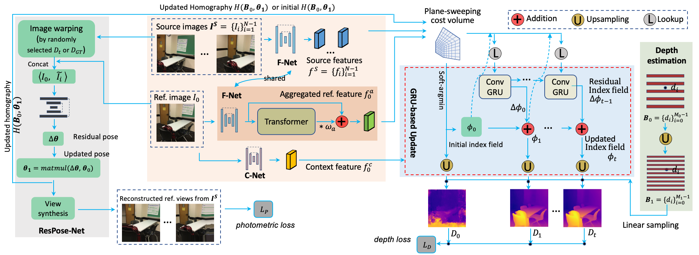
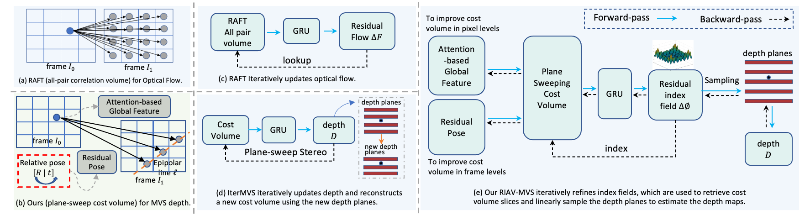

# RIAV-MVS: <span style="color:red"><ins>R</ins></span>ecurrent-<span style="color:green"><ins>I</ins></span>ndexing an <span style="color:blue"><ins>A</ins></span>symmetric <span style="color:green"><ins>V</ins></span>olume for <span style="color:orange"><ins>M</ins></span>ulti-<span style="color:orange"><ins>V</ins></span>iew <span style="color:orange"><ins>S</ins></span>tereo (CVPR 2023)

[](https://www.changjiangcai.com/riav-mvs.github.io/)
[](https://arxiv.org/abs/2205.14320)
[](https://www.youtube.com/watch?v=7nvtlz0Caso)
[](https://www.changjiangcai.com/riav-mvs.github.io/static/images/cvpr23_poster_RIAV-MVS.pdf)
[](https://www.changjiangcai.com/riav-mvs.github.io/static/images/RIAV-MVS-Slides-CVPR2023.pdf)


This repository contains an official PyTorch implementaiton for training and testing an MVS depth estimation method proposed in the paper: 

> **RIAV-MVS: Recurrent-Indexing an Asymmetric Volume for Multi-View Stereo**
> 
> [Changjiang Cai](https://www.changjiangcai.com/) <sup>\* </sup>, [Pan Ji](https://sites.google.com/view/panji530), [Qingan Yan](https://yanqingan.github.io/), [Yi Xu](https://scholar.google.com/citations?user=ldanjkUAAAAJ&hl=en) </br>

> OPPO US Research Center </br>
> <sup>*</sup> Corresponding author
> </br> 

<p align="center">
  
</p>

## 🆕 Updates

- 11/10/2024: Official code initially released per institutional approval.
- 06/01/2023: RIAV-MVS paper released, see arXiv [paper](https://arxiv.org/abs/2205.14320).

## 📋 Table of Contents
1. [Overview](#overview )
2. [Setup](#setup)
3. [Datasets](#datasets)
4. [Training](#training)
5. [Testing and Evaluation](#testing-and-evaluation)
6. [License](#license)
7. [Acknowledgements](#acknowledgements)
8. [Citations](#citations)
9. [Troubleshooting](#troubleshooting)


## 🌐 Overview <a id="overview"></a>
We present a learning-based approach for multi-view stereo (MVS), i.e., estimate the depth map of a reference frame using posed multi-view images. Our core idea lies in leveraging a “learning-to-optimize” paradigm to iteratively index a plane-sweeping cost volume and regress the depth map via a convolutional Gated Recurrent Unit (GRU). Besides, a pose module is leveraged to improve the relative pose among multi-view frames, and a self-attention block is applied only to the reference frame for constructing asymetrical matching volume for improved prediction.

See the comparison between ours and other SOTA baselines.

<p align="center">
  
</p>


## ⚙️ Setup <a id="setup"></a>

- The code has been tested with Python 3.10 and PyTorch 2.2.0 with CUDA 12.1. Assume the project is located at `~/riav-mvs`. We provide the Docker file at [docker/Dockerfile_oppo](./docker/Dockerfile_oppo) and the library requirements at [docker/dev_requirements.txt](./docker/dev_requirements.txt), which will be installed when you build the docker image (see below).

### Docker Environment:
- Build and run the docker:

```bash
cd ~/riav-mvs/docker
sh build.sh # build docker container
# it will generate a container with tag "changjiang_cai/mvs-raft:1.0".
# You can change the tag name in this build.sh script.

sh run.sh # run the container just generated above;

## (Optional) [Useful Tips ✍]: To exit Docker container without stopping it, press Ctrl+P followed by Ctrl+Q; 
# If you want to exit the container's interactive shell session, 
# but do not want to interrupt the processes running in it,
# press Ctrl+P followed by Ctrl+Q. 
# This operation detaches the container and 
# allows you to return to your system's shell.

## (Optional) [Useful Tips ✍]: Re-enter the Container
# get the container id
docker ps
#  Run as root, e.g., if you want to install some libraries via `pip`;
#  Here `d89c34efb04a` is the container id;
docker exec -it -u 0 d89c34efb04a bash
#  Run as regular user
docker exec -it d89c34efb04a bash

## (Optional) [Useful Tips ✍]: To save the container to a new docker image;
# After the pip installation, save the container to an image. 
# You can run the following from the outside of the docker container.
docker commit -m "some notes you specified" d89c34efb04a xyz/riavmvs:1.1
```

## 💾 Datasets <a id="datasets"></a>

### RGB-D Datasets
To train/evaluate RIAV-MVS, you will need to download the required datasets.
- [ScanNet](https://github.com/ScanNet/ScanNet), for train and within-dataset evaluation. See [data generation](src/datasets/scannet_export.py), and dataloader for [train/val](src/datasets/scannet_npz.py) and [evluation and benchmark](src/datasets/scannet_eval.py). More details about how to prepare the datasets for training and evaluation, can be found [here](src/datasets/dataset_info.md).

The following datasets are only used for evaluation to show cross-domain generalization performance.
- [7-Scenes](https://www.microsoft.com/en-us/research/project/rgb-d-dataset-7-scenes/), for cross-dataset evaluation. No need data reformat or export code, see [dataloader](src/datasets/seven_scenes_eval.py).

- [RGB-D Scenes V2](https://rgbd-dataset.cs.washington.edu/dataset/rgbd-scenes-v2/), for cross-dataset evaluation. See [data generation](src/datasets/rgbdscenesv2_export.py), and [dataloader](src/datasets/rgbdscenesv2_eval.py) for evluation.


### MVS Datasets
- [DTU](https://roboimagedata.compute.dtu.dk/?page_id=36), for train and evaluation. See dataloader for [train/val](src/datasets/dtu_yao.py) and [evluation and benchmark](src/datasets/dtu_yao_eval.py). 


## 📊 Testing and Evaluation <a id="testing-and-evaluation"></a>

### Pretrained Models on ScanNet

You can download the model checkpoints for our method and the baseline methods that we trained from scratch at this [link](https://www.dropbox.com/scl/fi/xhmuqy6jn9ojyijn8qngz/all_ckpts.zip?rlkey=ckcd7bwgzblzpt2mversll2km&st=w8rfodr0&dl=0).

Here we provide three varients of the pipeline for ablation, including:
- V1: `Base model`: our proposed paradigm that iteratively indexes
a plane-sweeping cost volume and regresses the depth map
via a convolutional Gated Recurrent Unit (GRU).
- V2: `+Pose model`: with a residual pose module to correct the relative poses, helping the cost volume construction at frame levels.
- V3: `+Pose,Atten model`: this is the full model. Besides the modules seen in V1 and V2, this variant includes a transformer block applied to the reference image (but not to the source images). It breaks the symmetry of the Siamese network (which is typically used in MVS to extract image features) to construct the so-called Asymmetric Volume in our paper. It embedded both the pixel-wise local (high-frequency) features via high-pass CNNs, and the long-range global (low-frequency)context by self-attention, to store more accurate matching similarity cues.


Our pretrained models trained on ScanNet training set can be **downloaded** as below. 


| Model Variants | V1 `(Base)` | V2 `(+Pose)`  |V3 `(+Pose,Atten` | 
|----|----|----|----|
|YAML Config  | `[1]` [riavmvs_base_test.yaml](config/riavmvs_base_test.yaml) | `[2]`[riavmvs_pose_test.yaml](config/riavmvs_pose_test.yaml) | `[3]`[riavmvs_full_test.yaml](config/riavmvs_full_test.yaml)|
|Checkpoint trained on ScanNet | `[4]`[riavmvs_base_epoch_002.pth.tar](https://www.dropbox.com/scl/fi/l64zmbvbwglz4wido8bke/riavmvs_base_epoch_002.pth.tar?rlkey=35kgvandun8zobddqygtdg0td&st=88l8q8xa&dl=0) | `[5]`[riavmvs_pose_epoch_003.pth.tar](https://www.dropbox.com/scl/fi/azut51e6lsw6c9d43fgti/riavmvs_pose_epoch_003.pth.tar?rlkey=q4o69auavhox6mt9vzw9ennfx&st=vootijux&dl=0) | `[6]`[riavmvs_full_epoch_007.pth.tar](https://www.dropbox.com/scl/fi/hr854bikqg0vk2zyz3ivh/riavmvs_full_epoch_007.pth.tar?rlkey=k5gtvud9ukxh0dzph18sbh96t&st=7i0q3nrc&dl=0) |


### Finetuned Models on DTU

Our pretrained models trained on ScanNet are further finetuned on DTU training set, which can be downloaded as below. Here we skip the V2 (+Pose) model on DTU since DTU has accurate poses.


| Model Variants | V1 `(Base)` |V3 `(+Pose,Atten` | 
|----|----|----|
|YAML Config  | `[7]` [riavmvs_base_dtu_test.yaml](config/riavmvs_base_dtu_test.yaml) | see `[3]` above|
|Checkpoint finetuned on DTU | `[8]`[riavmvs_base_dtu_epoch_04.pth.tar](https://www.dropbox.com/scl/fi/81rsdkqzfzzxigsgrssfa/riavmvs_base_dtu_epoch_04.pth.tar?rlkey=fw69gvtnktqwipguscfc3cd5k&st=u77axfoy&dl=0) | `[9]`[riavmvs_full_dtu_epoch_03.pth.tar](https://www.dropbox.com/scl/fi/c1yytla8ioxg9fvaps691/riavmvs_full_dtu_epoch_03.pth.tar?rlkey=5othxcd3lo9oiz90xqlfclvi2&st=tsvocg5k&dl=0) |


### Key Hyper-Parameters

1) `Base` model on ScanNet: Download our pretrained checkpoint shown in the table above and save it at a directory, e.g., the model `[4]`: `checkpoints_nfs/saved/released/riavmvs_base_epoch_002.pth.tar` trained on ScanNet. You can find the config YAML file at `[1]`: [config/riavmvs_base_test.yaml](config/riavmvs_base_test.yaml). Pay attention to these parameters:
```yaml
raft_mvs_type: 'raft_mvs' # mvs depth module;
pose_net_type: "none"
raft_depth_init_type: 'none'
```
 
2) `Base` model on DTU: Download our checkpoint shown in the table above and save it at a directory, e.g., the model `[8]`: `checkpoints_nfs/saved/released/riavmvs_base_dtu_epoch_04.pth.tar` finetuned on DTU. You can find the config YAML file at `[7]`: [riavmvs_base_dtu_test.yaml](config/riavmvs_base_dtu_test.yaml). Pay attention to these parameters:
```yaml
fusion_pairnet_feats: False # no feature fusion layers;
# -- mvs plane sweeping setup -- #
num_depth_bins: 96 # here we use 96 depth hypotheses planes;
```

3) `+Pose` model on ScanNet: Download our pretrained checkpoint and save it at a directory, e.g., the model `[5]`: `checkpoints_nfs/saved/released/riavmvs_pose_epoch_003.pth.tar` trained on ScanNet. You can find the config YAML file `[2]`: [config/riavmvs_pose_test.yaml](config/riavmvs_pose_test.yaml). 
Pay attention to these parameters:
```yaml
raft_mvs_type: 'raft_mvs' # mvs depth module;
pose_net_type: "resnet_pose"
raft_depth_init_type: 'none'
```

4) `Full` model on ScanNet or DTU: Download our pretrained checkpoint and save it at a directory, e.g., the model `[6]`: `checkpoints_nfs/saved/released/riavmvs_full_epoch_007.pth.tar` trained on ScanNet and the model `[9]`: `checkpoints_nfs/saved/released/riavmvs_pose_dtu_epoch_04.pth.tar` finetuned on DTU.  You can find the config YAML file at `[3]`: [config/riavmvs_full_test.yaml](config/riavmvs_full_test.yaml). Pay attention to these parameters:
```yaml
raft_mvs_type: 'raft_mvs_asyatt_f1_att' # attention to frame f1;
pose_net_type: "resnet_pose"
raft_depth_init_type: 'soft-argmin'
```


### Evaluation on ScanNet Test Set

We do same-domain evaluation. I.e., models are trained in the training set of ScanNet (or DTU), then are evaluated in the test set of the same domain ScanNet (or DTU).

We evaluate two sampling strategies to generate the evaluation frames: 1) the simple view selection strategy (i.e., sampling by every 10 frames, resulting in 20,668 samples) as in [ESTDepth CVPR'21](https://arxiv.org/pdf/2011.13118), and 2) the keyframe selection based on heuristics as in [Deep-VideoMVS CVPR'21](https://arxiv.org/pdf/2012.02177), resulting in 25,481 samples. 

Change this hyperparameter in the YAML configuration files, 
```yaml
scannet_eval_sampling_type: 'e-s10n3' # use this for simple sampling 
scannet_eval_sampling_type: 'd-kyn3' # use this for keyframe sampling 
```


<table>
    <thead>
        <tr>
            <th rowspan=3> Model </th>
            <th rowspan=3> Config </th>
            <th rowspan=3> Checkpoint </th>
            <th colspan=6> Evaluation on ScanNet Test-Set (unit: meter) </th>
        </tr>
        <tr>
            <th colspan=3> Simple Sampling </th>
            <th colspan=3> Keyframe Sampling </th>
        </tr>
        <tr>
            <th>  Abs-rel ↓ </th>
            <th>  Abs ↓ </th>
            <th>  δ < 1.25 ↑ </th>
            <th>  Abs-rel ↓ </th>
            <th>  Abs ↓ </th>
            <th>  δ < 1.25 ↑ </th>
        </tr>
    </thead>
    <tbody>
        <tr>
            <td> Our (base)</td>
            <td>  see <span style="background-color:gray;">[1]</span> </td>
            <td>  see <span style="background-color:gray;">[4]</span> </td>
            <td> 0.0885	</td> 
            <td> 0.1605	</td> 
            <td> 0.9211	</td> 
            <td> 0.0843	</td> 
            <td> 0.1603	</td> 
            <td> 0.9280	</td> 
        </tr>
        <tr>
            <td> Our (+pose)</td>
            <td>  see <span style="background-color:gray;">[2]</span> </td>
            <td>  see <span style="background-color:gray;">[5]</span> </td>
            <td> 0.0827	</td> 
            <td> 0.1523	</td> 
            <td> 0.9277	</td> 
            <td> 0.0790	</td> 
            <td> 0.1525	</td> 
            <td> 0.9344	</td> 
        </tr>
        <tr>
            <td> Our(+pose,atten)</td>
            <td>  see <span style="background-color:gray;">[3]</span> </td>
            <td>  see <span style="background-color:gray;">[6]</span> </td>
            <td> <b>0.0734</b>	</td> 
            <td> <b>0.1381</b>	</td> 
            <td> <b>0.9395</b>	</td> 
            <td> <b>0.0692</b>	</td> 
            <td> <b>0.1362</b>	</td> 
            <td> <b>0.9470</b>	</td> 
        </tr>
    </tbody>
</table>

- Here we provide three varients of our model for ablation. From the results, we can find the proposed residual pose module (see `Our(base)` vs `Our(+pose)`), and the so called asymetric attention module, which was applied to the reference view only, (see `Our(+pose,atten)` vs `Our(+pose)`), both help boost the performance. 
- `Our(+pose,atten)` is the full model, as the default one we used in most of the experiments. 

### Evaluation on DTU Test Set

<table>
    <thead>
        <tr>
            <th rowspan=2> Model </th>
            <th rowspan=2> Config </th>
            <th rowspan=2> Checkpoint </th>
            <th colspan=3> Evaluation on DTU Test-Set (unit: mm) </th>
        </tr>
        <tr>
            <th>  Abs-rel ↓ </th>
            <th>  Abs ↓ </th>
            <th>  rmse ↓ </th>
        </tr>
    </thead>
    <tbody>
        <tr>
            <td> Our (base)</td>
            <td>  see <span style="background-color:gray;">[7]</span> </td>
            <td>  see <span style="background-color:gray;">[8]</span> </td>
            <td> 0.0102	</td> 
            <td> 7.3564	</td> 
            <td> 19.6125	</td> 
        </tr>
        <tr>
            <td> Our(+pose,atten)</td>
            <td>  see <span style="background-color:gray;">[3]</span> </td>
            <td>  see <span style="background-color:gray;">[9]</span> </td>
            <td> <b>0.0091</b> </td> 
            <td> <b>6.7214</b> </td> 
            <td> <b>18.5950</b> </td> 
        </tr>
    </tbody>
</table>

- Here we provide two varients of our model for ablation. From the results, we can find the so called asymetric attention module, which was applied to the reference view only, help boost the performance. 

### Evaluation Script to Replicate Paper Results

Run the script to load the those checkpoints mentioned above will reproduce the results in Table 1 as shown in our paper. 

```bash
./run_test_exp.sh $MODEL_NAME $DATASET $GPU_ID
```

The default parameters are 
```bash
MODEL_NAME='OUR_RIAV_MVS_FULL'
DATASET='scannet_n3_eval'
GPU_ID=0
```

`Baseline Models`: We also provide the checkpoints for the baseline methods MVSNet, PairNet, IterMVS. We trained those baseline models fram scratch using the same training dataset and data augmentation as our proposed methods for fair comparison. You can find the YAML configuration files at `config/*`. Checkpoints are specified for each baseline in the bash script.

See more details in the bash script, and flexible arguments are provided for running experiments easily and protably.

## ⏳ Training <a id="training"></a>
For network training, run the following script

```bash
./run_train_exp.sh $MODEL_NAME $DATASET $GPU_ID
```

The default parameters are 
```bash
MODEL_NAME='OUR_RIAV_MVS_FULL'
DATASET='scannet_mea2_npz'
GPU_IDS=0,1
```

You can adjust other arguments at your will. More details can be found in the bash script for running experiments easily and protably.

## ⚖️ License <a id="license"></a>
The code in this repository is licensed under MIT licence, see [LICENSE](./LICENSE).


## 🙏 Acknowledgements <a id="acknowledgements"></a>
Our work partially adopts codes from [RAFT](https://github.com/princeton-vl/RAFT)(BSD 3-Clause License), [RAFT-Stereo](https://github.com/princeton-vl/RAFT-Stereo)(MIT License), [DeepVideoMVS](https://github.com/ardaduz/deep-video-mvs) (MIT License) and [GMA](https://github.com/zacjiang/GMA) (WTFPL License). We also compare our method with baselines [IterMVS](https://github.com/FangjinhuaWang/IterMVS)(MIT License) and [ESTDepth](https://github.com/xxlong0/ESTDepth)(MIT License) for most of the experiments. We sincerely thank those authors for making these repos available. 


## 📑 Citations <a id="citations"></a>
If you find our work useful, please consider citing our paper:

```plain
@InProceedings{cai2023riavmvs,
    author    = {Cai, Changjiang and Ji, Pan and Yan, Qingan and Xu, Yi},
    title     = {RIAV-MVS: Recurrent-Indexing an Asymmetric Volume for Multi-View Stereo},
    booktitle = {CVPR},
    month     = {June},
    year      = {2023},
    pages     = {919-928}
}
```

Please also consider our another MVS paper if you find it useful:

```plain
@InProceedings{liu2022planemvs,
    author    = {Liu, Jiachen and Ji, Pan and Bansal, Nitin and Cai, Changjiang and Yan, Qingan and Huang, Xiaolei and Xu, Yi},
    title     = {PlaneMVS: 3D Plane Reconstruction From Multi-View Stereo},
    booktitle = {CVPR},
    month     = {June},
    year      = {2022},
    pages     = {8665-8675}
}
```

## 🛠️ Troubleshooting <a id="troubleshooting"></a>

We will keep updating this section as issues arise.

- [1] torchvision/models/_utils.py:208 UserWarning: The parameter 'pretrained' is deprecated since 0.13 and may be removed in the future, please use 'weights' instead.
   - Solution: change line 26 `self.encoder = resnets[num_layers](pretrained)` to `self.encoder = resnets[num_layers](weights="IMAGENET1K_V2" if pretrained else None)`, e.g., in the file `third_parties/ESTDepth/hybrid_models/resnet_encoder.py`.